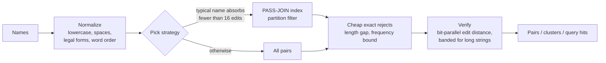

<div align="center">

<picture>
  <source media="(prefers-color-scheme: dark)" srcset="assets/logo-dark.svg">
  
</picture>

**Exact near-duplicate detection, record linkage and lookup for names, at scale.**

[](https://github.com/emirhuseynrmx/fuzzy-dedupe-rs/actions/workflows/ci.yml)
[](https://codecov.io/gh/emirhuseynrmx/fuzzy-dedupe-rs)
[](https://sonarcloud.io/summary/new_code?id=emirhuseynrmx_fuzzy-dedupe-rs)
[](LICENSE)


[Quick start](#quick-start) · [Benchmarks](#benchmarks) · [How it works](#how-it-works) · [Correctness](#correctness) · [API](#api-reference) · [CLI](#command-line) · [FAQ](#faq)

</div>

---

fuzzy-dedupe finds names that refer to the same thing, `"Acme Ltd"`, `"ACME  ltd"`, `"Acme Limited"`, inside one list, across two, or against a stored index one query at a time, and returns **exactly the pairs an exhaustive comparison would return**, only much faster.

It is built for the cleanup work every data team runs into: merging CRM exports, matching invoices to customers, collapsing supplier lists, reconciling registries, and checking new records for duplicates as they arrive. The core is Rust; you use it from Python or from the command line.

<table>
<tr>
<td width="25%" valign="top">

**Exact, not approximate**<br>
Every result is the result of a full comparison. The filters only skip pairs they can prove don't match, so nothing is lost and nothing is guessed.

</td>
<td width="25%" valign="top">

**Fast on real data**<br>
136x faster than RapidFuzz `cdist` on 100,000 UK company names, returning the same 21,513 pairs. 800,000 names in 1.7 minutes on a laptop.

</td>
<td width="25%" valign="top">

**Built for live systems**<br>
A persistent, incremental `Index`: 0.05 ms median per query against 800,000 stored names, with the same results as scanning all of them.

</td>
<td width="25%" valign="top">

**Checked against itself**<br>
A pure-Python reference ships in the package. Property tests check every strategy against it on every change, and CI checks RapidFuzz agrees too.

</td>
</tr>
</table>

## Quick start

```bash
git clone https://github.com/emirhuseynrmx/fuzzy-dedupe-rs && cd fuzzy-dedupe-rs
python -m venv .venv && source .venv/bin/activate      # Windows: .venv\Scripts\activate
pip install maturin && maturin develop --release
```

**Deduplicate a list, or match two**

```python
from fuzzy_dedupe import find_duplicates, cluster, link

names = ["Acme Ltd", "ACME  ltd", "Acme Ltd.", "Globex", "Ltd Acme"]

find_duplicates(names, threshold=0.2)
# [(0, 1, 0.0), (0, 2, 0.1111111111111111), (1, 2, 0.1111111111111111)]

cluster(names, threshold=0.2, token_sort=True)              # word order ignored
# [[0, 1, 2, 4]]

link(["Acme Ltd", "Globex"], ["GLOBEX", "Initech", "acme ltd."])   # match two lists
# [(0, 2, 0.1111111111111111), (1, 0, 0.0)]

find_duplicates(["Acme Ltd", "Acme Limited"], threshold=0.0, strip_suffixes=True)
# [(0, 1, 0.0)]                                            # legal forms ignored

find_duplicates(["ABC TEKSTİL SANAYİ VE TİCARET LİMİTED ŞİRKETİ",
                 "Abc Tekstil San. ve Tic. Ltd. Şti.",
                 "ABC TEKSTIL SAN.VE TIC.LTD.STI."],
                threshold=0.0, strip_suffixes=True, turkish=True)
# [(0, 1, 0.0), (0, 2, 0.0), (1, 2, 0.0)]                  # Turkish case, letters and legal tail
```

**Check new records against a stored index**

```python
from fuzzy_dedupe import Index

idx = Index.build(["Acme Ltd", "Globex Corp", "Initech"], threshold=0.2)
idx.query("ACME ltd.")          # [(0, 0.1111111111111111)]   id and score
idx.add(["Umbrella Corp"])      # 3: ids of new names start here; nothing is re-indexed
idx.save("customers.json")      # settings and names, as JSON
idx = Index.load("customers.json")
```

**From the shell**

```bash
fuzzy-dedupe customers.csv --column name --groups --strip-suffixes -o groups.csv
fuzzy-dedupe crm.csv --column name --link invoices.csv --link-column customer
```

## Benchmarks

All numbers below were measured on one Windows laptop (AMD, 12 threads, Python 3.13) with the scripts in [`bench/`](bench/). Full output, including the exact commands, is in [`bench/results.md`](bench/results.md). Your hardware and data will give different numbers; run the scripts to see yours.

### Real company names vs RapidFuzz

Companies House (UK) registered company names, a seeded random sample, threshold 0.1. RapidFuzz scores every pair with `process.cdist` on all cores; fuzzy-dedupe skips the pairs its filters prove can't match. Both use the same measure on the same normalized strings, and **both returned identical pairs at every size.**

| Names | Duplicate pairs | RapidFuzz `cdist` | fuzzy-dedupe | Speed-up |
|---:|---:|---:|---:|---:|
| 10,000 | 226 | 633 ms | **17 ms** | 37x |
| 50,000 | 5,646 | 17.15 s | **157 ms** | 109x |
| 100,000 | 21,513 | 68.21 s | **500 ms** | 136x |
| 800,000 | 1,383,297 | not run (all-pairs) | **102.5 s** | |

On one thread each, 10,000 names take 2.89 s with RapidFuzz and 37 ms with fuzzy-dedupe (78x).

### One query at a time: the persistent index

800,000 Companies House names in an `Index` (built in 1.1 s), queried with 1,000 messy copies of stored names, the "is this customer already in the CRM?" case. RapidFuzz answers the same question with `process.extract` over the whole list; it returned the same matches as `Index.query` on all 50 queries timed for it.

| | Median per query | 95th percentile |
|---|---:|---:|
| RapidFuzz `process.extract` | 78.70 ms | 89.57 ms |
| fuzzy-dedupe `Index.query` | **0.05 ms** | **5.66 ms** |

### Labelled benchmark: DBLP-ACM

Paper titles from two bibliographies, 2,616 x 2,294, with 2,224 known true matches ([Köpcke, Thor, Rahm, PVLDB 2010](https://dbs.uni-leipzig.de/research/projects/benchmark-datasets-for-entity-resolution)). Matching on the title alone:

| Threshold | Pairs found | Precision | Recall | F1 | fuzzy-dedupe | RapidFuzz `cdist` |
|---:|---:|---:|---:|---:|---:|---:|
| 0.05 | 2,384 | 0.876 | 0.939 | 0.906 | **9 ms** | 55 ms |
| 0.10 | 2,406 | 0.876 | 0.947 | 0.910 | **15 ms** | 59 ms |
| 0.20 | 2,466 | 0.869 | 0.964 | **0.914** | **54 ms** | 61 ms |
| 0.30 | 2,556 | 0.849 | 0.976 | 0.908 | **55 ms** | 83 ms |

Both tools return the same pairs, so precision and recall are identical; only time differs. Titles are long (most over 64 characters), which is where the banded kernel and the frequency filter earn their place.

### Legal forms: `strip_suffixes`

Real registry names contain boilerplate ("Limited", "Ltd", "GmbH") that makes different companies look alike and the same company look different. On 50,000 real Companies House names plus messy copies with a known ground truth (16,873 true duplicate pairs, [`bench/suffix_quality.py`](bench/suffix_quality.py)):

| Threshold | F1 without | F1 with `strip_suffixes` | Precision with | Recall with |
|---:|---:|---:|---:|---:|
| 0.05 | 0.584 | **0.814** | 0.983 | 0.695 |
| 0.10 | 0.547 | **0.806** | 0.791 | 0.822 |
| 0.15 | 0.306 | **0.552** | 0.403 | 0.875 |

### Turkish names: `turkish=True`

Turkish data breaks generic normalization three ways: `"İ".lower()` is not `"i"` and `"I".lower()` is not `"ı"`; the same name is typed with and without Turkish letters (`TEKSTİL` / `TEKSTIL`); and the legal tail is long and written a dozen ways (`SANAYİ VE TİCARET ANONİM ŞİRKETİ`, `SAN. VE TİC. A.Ş.`, `SAN.TİC.A.Ş.`). On 9,992 real Turkish legal names from the GLEIF register plus messy copies with a known ground truth (4,147 true duplicate pairs, [`bench/turkish_quality.py`](bench/turkish_quality.py)), threshold 0.05:

| Settings | Precision | Recall | F1 |
|---|---:|---:|---:|
| default | 0.395 | 0.238 | 0.297 |
| `strip_suffixes` | 0.397 | 0.239 | 0.298 |
| `turkish` | 0.523 | 0.530 | 0.526 |
| `turkish` + `strip_suffixes` | 0.642 | 0.832 | 0.725 |
| **`turkish` + `strip_suffixes` + pair rules** | **0.971** | **0.794** | **0.874** |

Generic legal-form stripping does almost nothing on Turkish names; Turkish mode more than doubles F1. Turkish mode also recognises tails typed with a typo (`TİCAERT`, `SANAİY`, `İHRACA`) and run together (`SAN.TİC.A.Ş.`).

### Pair rules: `numbers_must_match` and `word_threshold`

Edit distance alone has one blind spot on legal names: two different companies that share a long template. `NEO PORTFÖY BİRİNCİ SERBEST FON` and `NEO PORTFÖY İKİNCİ SERBEST FON` are one word apart in forty characters; so are `DENİZ PORTFÖY ARMUT SERBEST FON` and `DENİZ PORTFÖY RU SERBEST FON`. Two optional rules close it, on top of the threshold:

- `numbers_must_match=True`: words containing digits, and in Turkish mode ordinal words (`birinci` … `doksandokuzuncu`, `yüzüncü`), must be the same in both names. Fund 2 is not fund 3.
- `word_threshold=T`: the words the two names do not share, joined, must themselves be within `T`. A typo inside a word passes; a whole word swapped for another does not.

Both only ever remove pairs, so every search strategy still returns exactly the brute-force answer (checked by property tests in Rust and Python). On the same Turkish benchmark, with `word_threshold=0.34`:

| Threshold | F1 without rules | F1 with rules | Precision with rules | Recall with rules |
|---:|---:|---:|---:|---:|
| 0.05 | 0.725 | **0.874** | 0.971 | 0.794 |
| 0.10 | 0.300 | **0.899** | 0.936 | 0.865 |
| 0.15 | 0.117 | **0.893** | 0.903 | 0.882 |
| 0.20 | 0.048 | **0.886** | 0.883 | 0.889 |

Without the rules, raising the threshold buys recall at a ruinous cost in precision. With them, precision stays near 0.9 up to 0.2, so the threshold can be set for recall. The CLI flag `--precise` turns on both rules with `word_threshold=0.34` (full table in [`bench/results.md`](bench/results.md)).

### Against plain Python

3,000 synthetic company names: 148.5 s in pure Python, 8 ms in fuzzy-dedupe, same pairs.

## How it works



A pair matches when `edit_distance / longer_length <= threshold`. For a longer name of length `L` that allows at most `k` edits, the largest integer with `k / L <= threshold`. Every stage below either proves a pair can't match or computes its exact distance.

| Stage | What it does | Based on |
|---|---|---|
| Partition filter | Cut a name into `k + 1` segments. Each edit disturbs at most one, so a true match keeps one segment intact at a bounded offset in the other name. Segments go into a hash index; only names sharing a segment at a compatible position are compared. | Li, Deng, Wang, Feng. *PASS-JOIN: A Partition-based Method for Similarity Joins.* PVLDB 5(3), 2011. [arXiv:1111.7171](https://arxiv.org/abs/1111.7171) |
| Persistent index | Each stored name is segmented once for every edit budget it can ever need, so later additions never force re-indexing, and a query can match stored names shorter or longer than itself. | PASS-JOIN's pigeonhole argument, applied in both directions |
| Frequency bound | One edit changes the character counts by at most 2, so `edit_distance >= L1(counts) / 2`. A 32-byte sketch per name rejects most far-apart pairs before any dynamic programming. | Kahveci, Singh. *Efficient Index Structures for String Databases.* VLDB 2001 |
| Verification, up to 64 chars | Myers' bit-vector algorithm: one DP column per character in a few word operations. Match masks are built once per name and reused. | Myers. *A fast bit-vector algorithm for approximate string matching based on dynamic programming.* JACM 46(3), 1999. Hyyrö. *Explaining and extending the bit-parallel approximate string matching algorithm of Myers.* Tech. report A-2001-10, Univ. of Tampere, 2001 |
| Verification, longer | When the edit budget fits in one word, only the diagonal band of width `2k + 1` is computed, with an early exit; otherwise multi-word blocks. | Hyyrö. *A bit-vector algorithm for computing Levenshtein and Damerau edit distances.* Nordic J. Computing 10(1), 2003. Myers 1999, §5 |
| Grouping | Connected components of the match graph. | Papadakis et al. *Blocking and Filtering Techniques for Entity Resolution: A Survey.* ACM CSUR 53(2), 2020. [arXiv:1905.06167](https://arxiv.org/abs/1905.06167) |

Work runs on all cores with rayon, with Python's GIL released.

## Correctness

"Exact" is the whole point, so it is tested as a property, not with examples:

- **Rust, `cargo test`:** proptest checks, on random names and thresholds, that the index returns exactly the brute-force pairs (one list and two lists), that `Index.query` equals scanning every stored name including names added later, that single-word, multi-word and banded bit-parallel distances equal dynamic programming, that the frequency sketch never exceeds the true distance, and that the threshold arithmetic matches the float rule. CI runs 2,000 cases per property.
- **Python, `pytest`:** Hypothesis generates lists with mixed case, spacing, legal forms and non-ASCII characters and checks that `auto`, `indexed` and `brute` all equal the pure-Python reference, for pairs, clusters, links and index queries, with and without `token_sort` and `strip_suffixes`.
- **Cross-implementation:** CI runs the DBLP-ACM comparison on every push and fails if fuzzy-dedupe and RapidFuzz disagree on a single pair.
- **Scores:** both implementations divide the same two integers, so scores match bit for bit.

## API reference

| Function | Returns |
|---|---|
| `find_duplicates(names, threshold=0.2, *, token_sort=False, strip_suffixes=False, turkish=False, numbers_must_match=False, word_threshold=None, method="auto")` | `list[(i, j, score)]`, `i < j`, sorted |
| `cluster(names, threshold=0.2, *, token_sort=False, strip_suffixes=False, turkish=False, numbers_must_match=False, word_threshold=None, method="auto")` | `list[list[int]]`, groups of two or more |
| `link(left, right, threshold=0.2, *, token_sort=False, strip_suffixes=False, turkish=False, numbers_must_match=False, word_threshold=None, method="auto")` | `list[(i, j, score)]`, `left[i]` matches `right[j]` |
| `stats(names, threshold=0.2, *, token_sort=False, strip_suffixes=False, turkish=False, numbers_must_match=False, word_threshold=None)` | `(pairs found, candidate pairs verified, all pairs)`: how much work the filters skipped |
| `levenshtein(a, b)` | edit distance in characters |

| `Index` | |
|---|---|
| `Index(threshold=0.2, *, token_sort=False, strip_suffixes=False, turkish=False, numbers_must_match=False, word_threshold=None)` | empty index |
| `Index.build(names, threshold, ...)` | index holding `names`, ids `0..len-1` |
| `idx.add(names)` | id of the first new name; ids are consecutive |
| `idx.query(name)` | `list[(id, score)]`, sorted by id |
| `idx.query_many(names)` | one result list per name, computed in parallel |
| `idx.save(path)` / `Index.load(path)` | JSON with the settings and names; `load` rebuilds the index |
| `idx.names()`, `len(idx)`, `idx.threshold` | stored names, count, settings |

- `threshold` is in `[0, 1]`: the edit distance divided by the longer name's length.
- `token_sort=True` sorts words before comparing, so `"Ltd Acme"` equals `"Acme Ltd"`.
- `strip_suffixes=True` drops legal forms at the end: Ltd, Limited, LLC, LLP, PLC, Inc, Corp, Co, GmbH, AG, SA, SRL, BV, NV, Pty, A.Ş., Ltd. Şti. and similar, as long as one word remains. Runs written without spaces (`Tic.Ltd.Şti.`) count if every dot-separated piece is a legal word.
- `turkish=True` applies Turkish case rules (`I` → `ı`, `İ` → `i`) and folds Turkish letters to ASCII (`ç ğ ı ö ş ü â î û`), so `TEKSTİL`, `TEKSTIL`, `Tekstil` and `tekstıl` agree. With `strip_suffixes` it also drops the Turkish legal and trade tail: Sanayi ve Ticaret, San. ve Tic., Anonim/Limited Şirketi, A.Ş., Ltd. Şti., İthalat İhracat, İç ve Dış Ticaret, Kollektif/Komandit Şirketi. Sector words such as Tekstil or Gıda are kept: they tell companies apart. Long tail words with one typo or swapped pair (`Ticaert`, `Sanaiy`) count too.
- `numbers_must_match=True` rejects a pair whose numbers differ (digits, and Turkish ordinals in Turkish mode).
- `word_threshold=T` rejects a pair whose differing words, joined, are further apart than `T`. `0.34` suits long legal names.
- `method`: `"auto"` picks the index or all pairs from the data; `"indexed"` and `"brute"` force one. All three return the same result.
- `find_duplicates_python`, `cluster_python`, `link_python`: the pure-Python reference, same signatures without `method`.
- Fully typed (`py.typed`).

## Command line

```text
fuzzy-dedupe INPUT.csv --column NAME [--threshold 0.2] [--token-sort] [--strip-suffixes] [--turkish]
                      [--numbers-must-match] [--word-threshold T] [--precise]
                       [--groups | --link OTHER.csv [--link-column NAME]] [-o OUT.csv]
```

| Mode | Output columns |
|---|---|
| pairs (default) | `row_a, row_b, name_a, name_b, score` |
| `--groups` | `group, row, name` |
| `--link` | `row, other_row, name, other_name, score` |

## Data quality first, with ProofFrame

[`examples/clean_customers.py`](examples/clean_customers.py) validates a customer CSV with [ProofFrame](https://github.com/emirhuseynrmx/proofframe) before deduplicating it, so a missing name or a repeated id is reported instead of quietly skewing the result.

```text
Step 1: checked 15 rows, 2 problems
  line 8 (customer #7): name - Null value is not allowed
  line 10 (customer #8): customer_id - Duplicate value detected

Step 2: looking for duplicates in the 13 rows that passed
  #1 'Acme Ltd'               ~ #2 'ACME  ltd'              distance 0.00
  #9 'Şişecam A.Ş.'           ~ #10 'şişecam a.ş'            distance 0.08
  #12 'Stark Industries'       ~ #13 'Stark Industires'       distance 0.12
```

## Where it fits

| You need | Use |
|---|---|
| Every pair within an edit-distance threshold, in one list or two, exactly | **fuzzy-dedupe** |
| "Does this new record already exist?" against a large stored list, repeatedly | **fuzzy-dedupe `Index`** |
| Many scoring functions (ratio, partial ratio, Jaro-Winkler) or top-k by score | [RapidFuzz](https://github.com/rapidfuzz/RapidFuzz) |
| Probabilistic or learned matching across several fields | [Splink](https://github.com/moj-analytical-services/splink), [dedupe](https://github.com/dedupeio/dedupe) |
| Matches that don't look alike as strings ("IBM" / "International Business Machines") | embedding or LLM-based matching |

## Limitations

- One similarity measure: character edit distance relative to the longer string. No phonetic or semantic matching.
- `cluster` uses transitive closure, so a chain of close names can join two distant ones. Review large groups.
- The legal-form lists for `strip_suffixes` are fixed (common English and European forms, plus the Turkish tail in Turkish mode); they aren't configurable yet, and only the end of a name is stripped.
- Turkish mode folds `ı`/`i`, `ş`/`s` and the rest, so two different words that differ only in those letters become equal. For company names that is the intended trade-off.
- `word_threshold` also rejects true duplicates where a whole word was dropped or replaced (`ABC Gıda` vs `ABC Gıda Pazarlama`). On the Turkish benchmark the pair rules cost 4 to 8 points of recall (0.832 -> 0.794 at threshold 0.05, 0.964 -> 0.889 at 0.2); leave it off when recall matters more than precision.
- Python's `str.split()` treats `\x1c`–`\x1f` as whitespace and Rust doesn't; strip those control characters first if your data has them.
- The index keeps every name and its segments in memory; `save` stores names, not the index, so `load` rebuilds it (800,000 names in about a second on the benchmark machine).

## Reproduce the benchmarks

```bash
pip install rapidfuzz numpy
python bench/rapidfuzz_compare.py --dblp-acm                               # downloads 270 KB
python bench/rapidfuzz_compare.py --sizes 10000 50000 100000               # downloads Companies House part 1 (73 MB)
python bench/index_bench.py --n 800000 --queries 1000
python bench/suffix_quality.py --n 50000
python bench/turkish_quality.py                                            # downloads Turkish legal names from GLEIF
python bench/bench.py 3000 20000 100000                                    # synthetic, includes pure Python
```

Datasets are downloaded on first use into `bench/.cache/` and are not redistributed here.

## FAQ

**Is it approximate, like MinHash or embeddings?**
No. Every filter is lossless: every pair within the threshold is returned, with the exact score.

**Why is `threshold` relative to the longer name?**
So that one setting works for short and long names alike: 0.1 allows one edit in ten characters, three in thirty.

**Does the index stay exact after `add`?**
Yes. Each name is indexed for every edit budget it can ever need, so the results after any sequence of `add` calls equal a full scan; the property tests check exactly that.

**Does it handle non-English names?**
Yes. Comparison is on Unicode characters, not bytes, with Unicode-aware lowercasing. Turkish has a dedicated mode (`turkish=True`) for its dotted and dotless i, text typed without Turkish letters, and its long legal tails.

**Can I force a strategy?**
Yes, `method="indexed"` or `method="brute"`. The result is identical; only speed changes.

## Project

- [CHANGELOG](CHANGELOG.md) · [CONTRIBUTING](CONTRIBUTING.md) · [SECURITY](SECURITY.md) · [CITATION](CITATION.cff)
- Licensed under the [Apache License 2.0](LICENSE). See [NOTICE](NOTICE).
