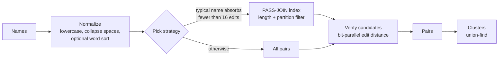

<div align="center">

<picture>
  <source media="(prefers-color-scheme: dark)" srcset="assets/logo-dark.svg">
  
</picture>

**Exact near-duplicate detection and record linkage for names, at scale.**

[](https://github.com/emirhuseynrmx/fuzzy-dedupe-rs/actions/workflows/ci.yml)
[](https://codecov.io/gh/emirhuseynrmx/fuzzy-dedupe-rs)
[](https://sonarcloud.io/summary/new_code?id=emirhuseynrmx_fuzzy-dedupe-rs)
[](LICENSE)


[Quick start](#quick-start) · [Benchmarks](#benchmarks) · [How it works](#how-it-works) · [Correctness](#correctness) · [API](#api-reference) · [CLI](#command-line) · [FAQ](#faq)

</div>

---

fuzzy-dedupe finds names that refer to the same thing, `"Acme Ltd"`, `"ACME  ltd"`, `"Acme Ltd."`, inside one list or across two, and returns **exactly the pairs an exhaustive comparison would return**, only much faster.

It is built for the cleanup work every data team runs into: merging CRM exports, matching invoices to customers, collapsing supplier lists, reconciling registries. The core is Rust; you use it from Python or from the command line.

<table>
<tr>
<td width="33%" valign="top">

**Exact, not approximate**<br>
Every result is the result of a full comparison. The filter only skips pairs it can prove don't match, so nothing is lost and nothing is guessed.

</td>
<td width="33%" valign="top">

**Fast on real data**<br>
35.6x faster than RapidFuzz `cdist` on 100,000 UK company names, returning the same 21,513 pairs. 800,000 names in 4.3 minutes on a laptop.

</td>
<td width="33%" valign="top">

**Checked against itself**<br>
A pure-Python reference ships in the package. Property tests check on every change that the Rust core returns the same pairs, and CI checks that RapidFuzz does too.

</td>
</tr>
</table>

## Quick start

```bash
git clone https://github.com/emirhuseynrmx/fuzzy-dedupe-rs && cd fuzzy-dedupe-rs
python -m venv .venv && source .venv/bin/activate      # Windows: .venv\Scripts\activate
pip install maturin && maturin develop --release
```

```python
from fuzzy_dedupe import find_duplicates, cluster, link

names = ["Acme Ltd", "ACME  ltd", "Acme Ltd.", "Globex", "Ltd Acme"]

find_duplicates(names, threshold=0.2)
# [(0, 1, 0.0), (0, 2, 0.1111111111111111), (1, 2, 0.1111111111111111)]

cluster(names, threshold=0.2, token_sort=True)              # word order ignored
# [[0, 1, 2, 4]]

link(["Acme Ltd", "Globex"], ["GLOBEX", "Initech", "acme ltd."])   # match two lists
# [(0, 2, 0.1111111111111111), (1, 0, 0.0)]
```

```bash
fuzzy-dedupe customers.csv --column name --groups -o groups.csv
fuzzy-dedupe crm.csv --column name --link invoices.csv --link-column customer
```

## Benchmarks

All numbers below were measured on one Windows laptop (AMD, 12 threads, Python 3.13) with the scripts in [`bench/`](bench/). Full output, including the exact commands, is in [`bench/results.md`](bench/results.md). Your hardware and data will give different numbers; run the scripts to see yours.

### Real company names vs RapidFuzz

Companies House (UK) registered company names, a seeded random sample, threshold 0.1. RapidFuzz scores every pair with `process.cdist` on all cores; fuzzy-dedupe skips the pairs its index proves can't match. Both use the same measure on the same normalized strings, and **both returned identical pairs at every size.**

| Names | Duplicate pairs | RapidFuzz `cdist` | fuzzy-dedupe | Speed-up |
|---:|---:|---:|---:|---:|
| 10,000 | 226 | 634 ms | **28 ms** | 22.3x |
| 50,000 | 5,646 | 16.04 s | **459 ms** | 35.0x |
| 100,000 | 21,513 | 61.17 s | **1.72 s** | 35.6x |
| 800,000 | 1,383,297 | not run (all-pairs) | **258.8 s** | |

On one thread each, 10,000 names take 2.89 s with RapidFuzz and 168 ms with fuzzy-dedupe (17.2x).

### Labelled benchmark: DBLP-ACM

Paper titles from two bibliographies, 2,616 x 2,294, with 2,224 known true matches ([Köpcke, Thor, Rahm, PVLDB 2010](https://dbs.uni-leipzig.de/research/projects/benchmark-datasets-for-entity-resolution)). Matching on the title alone:

| Threshold | Pairs found | Precision | Recall | F1 | fuzzy-dedupe | RapidFuzz `cdist` |
|---:|---:|---:|---:|---:|---:|---:|
| 0.05 | 2,384 | 0.876 | 0.939 | 0.906 | **8 ms** | 63 ms |
| 0.10 | 2,406 | 0.876 | 0.947 | 0.910 | **16 ms** | 62 ms |
| 0.20 | 2,466 | 0.869 | 0.964 | **0.914** | **62 ms** | 66 ms |
| 0.30 | 2,556 | 0.849 | 0.976 | 0.908 | 151 ms | **77 ms** |

Both tools return the same pairs, so precision and recall are identical; only time differs. At 0.30 on long titles RapidFuzz is about 2x faster: each title then absorbs around 18 edits, the index filters little, and RapidFuzz's banded bit-parallel kernel is the better tool for that regime. See [Where it fits](#where-it-fits).

### Against plain Python

3,000 synthetic company names: 168.3 s in pure Python, 10 ms in fuzzy-dedupe, same pairs.

## How it works



A pair matches when `edit_distance / longer_length <= threshold`. For a longer name of length `L` that allows at most `k` edits, the largest integer with `k / L <= threshold`.

| Stage | What it does | Based on |
|---|---|---|
| Partition filter | Cut the shorter name into `k + 1` segments. Each edit disturbs at most one, so a true match keeps one segment intact, at a bounded offset in the other name. Segments go into a hash index; only names sharing a segment at a compatible position are compared. The position window is the multi-match-aware bound, proven complete. | Li, Deng, Wang, Feng. *PASS-JOIN: A Partition-based Method for Similarity Joins.* PVLDB 5(3), 2011. [arXiv:1111.7171](https://arxiv.org/abs/1111.7171) |
| Two-list join | Both lists share one index; only cross-list pairs are verified. | PASS-JOIN, R-S join variant |
| Verification, up to 64 chars | Myers' bit-vector algorithm: one DP column per text character in a few word operations. Match masks are built once per name and reused across its candidates. | Myers. *A fast bit-vector algorithm for approximate string matching based on dynamic programming.* JACM 46(3), 1999. Hyyrö. *Explaining and extending the bit-parallel approximate string matching algorithm of Myers.* Tech. report A-2001-10, Univ. of Tampere, 2001 |
| Verification, longer | Multi-word blocks with the horizontal delta carried between blocks. | Myers 1999, §5. Hyyrö. *A bit-vector algorithm for computing Levenshtein and Damerau edit distances.* Nordic J. Computing 10(1), 2003 |
| Grouping | Connected components of the match graph. | Papadakis et al. *Blocking and Filtering Techniques for Entity Resolution: A Survey.* ACM CSUR 53(2), 2020. [arXiv:1905.06167](https://arxiv.org/abs/1905.06167) |

Work runs on all cores with rayon, with Python's GIL released.

## Correctness

"Exact" is the whole point, so it is tested as a property, not with examples:

- **Rust, `cargo test`:** proptest checks, on random names and thresholds, that the index returns exactly the brute-force pairs (one list and two lists), that single-word and multi-word bit-parallel distances equal dynamic programming, and that the threshold arithmetic matches the float rule. CI runs 2,000 cases per property.
- **Python, `pytest`:** Hypothesis generates lists with mixed case, spacing and non-ASCII characters and checks that `auto`, `indexed` and `brute` all equal the pure-Python reference, for pairs, clusters and links, at thresholds from 0 to 1, with and without `token_sort`.
- **Cross-implementation:** CI runs the DBLP-ACM comparison on every push and fails if fuzzy-dedupe and RapidFuzz disagree on a single pair.
- **Scores:** both implementations divide the same two integers, so scores match bit for bit.

## API reference

| Function | Returns |
|---|---|
| `find_duplicates(names, threshold=0.2, *, token_sort=False, method="auto")` | `list[(i, j, score)]`, `i < j`, sorted |
| `cluster(names, threshold=0.2, *, token_sort=False, method="auto")` | `list[list[int]]`, groups of two or more |
| `link(left, right, threshold=0.2, *, token_sort=False, method="auto")` | `list[(i, j, score)]`, `left[i]` matches `right[j]` |
| `levenshtein(a, b)` | edit distance in characters |

- `threshold` is in `[0, 1]`: the edit distance divided by the longer name's length.
- `token_sort=True` sorts words before comparing, so `"Ltd Acme"` equals `"Acme Ltd"`.
- `method`: `"auto"` picks the index or all pairs from the data; `"indexed"` and `"brute"` force one. All three return the same result.
- `find_duplicates_python`, `cluster_python`, `link_python`: the pure-Python reference, same signatures without `method`.
- Fully typed (`py.typed`).

## Command line

```text
fuzzy-dedupe INPUT.csv --column NAME [--threshold 0.2] [--token-sort]
                       [--groups | --link OTHER.csv [--link-column NAME]] [-o OUT.csv]
```

| Mode | Output columns |
|---|---|
| pairs (default) | `row_a, row_b, name_a, name_b, score` |
| `--groups` | `group, row, name` |
| `--link` | `row, other_row, name, other_name, score` |

## Data quality first, with ProofFrame

[`examples/clean_customers.py`](examples/clean_customers.py) validates a customer CSV with [ProofFrame](https://github.com/emirhuseynrmx/proofframe) before deduplicating it, so a missing name or a repeated id is reported instead of quietly skewing the result.

```text
Step 1: checked 15 rows, 2 problems
  line 8 (customer #7): name - Null value is not allowed
  line 10 (customer #8): customer_id - Duplicate value detected

Step 2: looking for duplicates in the 13 rows that passed
  #1 'Acme Ltd'               ~ #2 'ACME  ltd'              distance 0.00
  #9 'Şişecam A.Ş.'           ~ #10 'şişecam a.ş'            distance 0.08
  #12 'Stark Industries'       ~ #13 'Stark Industires'       distance 0.12
```

## Where it fits

| You need | Use |
|---|---|
| Every pair within an edit-distance threshold, in one list or two, exactly | **fuzzy-dedupe** |
| Many scoring functions (ratio, partial ratio, Jaro-Winkler), top-k lookups, or high thresholds on long strings | [RapidFuzz](https://github.com/rapidfuzz/RapidFuzz) |
| Probabilistic or learned matching across several fields | [Splink](https://github.com/moj-analytical-services/splink), [dedupe](https://github.com/dedupeio/dedupe) |
| Matches that don't look alike as strings ("IBM" / "International Business Machines") | embedding or LLM-based matching |

## Limitations

- One similarity measure: character edit distance relative to the longer string. No phonetic or semantic matching.
- `cluster` uses transitive closure, so a chain of close names can join two distant ones. Review large groups.
- On long strings at high thresholds the index filters little and RapidFuzz is faster (see DBLP-ACM at 0.30).
- Python's `str.split()` treats `\x1c`–`\x1f` as whitespace and Rust doesn't; strip those control characters first if your data has them.
- The index holds every segment of every name in memory.

## Reproduce the benchmarks

```bash
pip install rapidfuzz numpy
python bench/rapidfuzz_compare.py --dblp-acm                               # downloads 270 KB
python bench/rapidfuzz_compare.py --sizes 10000 50000 100000               # downloads Companies House part 1 (73 MB)
python bench/bench.py 3000 20000 100000                                    # synthetic, includes pure Python
```

Datasets are downloaded on first use into `bench/.cache/` and are not redistributed here.

## FAQ

**Is it approximate, like MinHash or embeddings?**
No. The filter is lossless: every pair within the threshold is returned, with the exact score.

**Why is `threshold` relative to the longer name?**
So that one setting works for short and long names alike: 0.1 allows one edit in ten characters, three in thirty.

**Does it handle non-English names?**
Yes. Comparison is on Unicode characters, not bytes, with Unicode-aware lowercasing (`Şişecam` equals `şişecam`).

**Can I force a strategy?**
Yes, `method="indexed"` or `method="brute"`. The result is identical; only speed changes.

## Project

- [CHANGELOG](CHANGELOG.md) · [CONTRIBUTING](CONTRIBUTING.md) · [SECURITY](SECURITY.md) · [CITATION](CITATION.cff)
- Licensed under the [Apache License 2.0](LICENSE). See [NOTICE](NOTICE).
